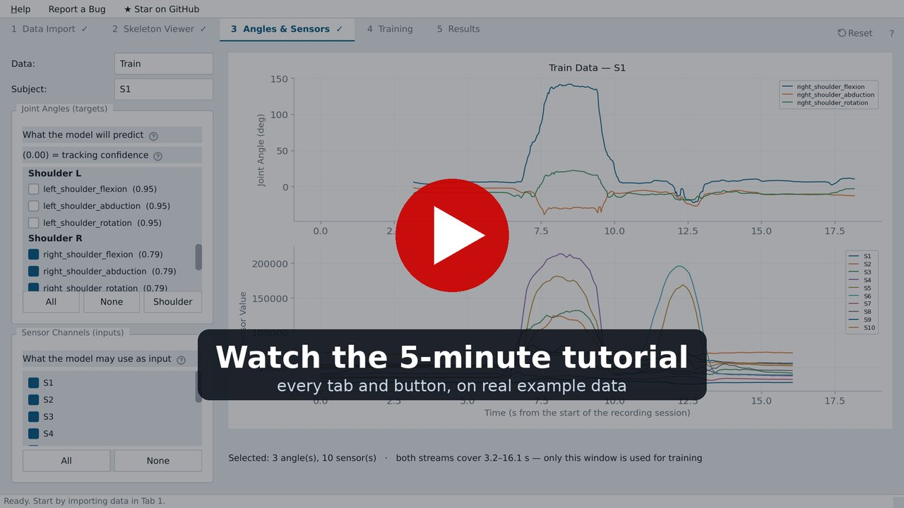

# E-Textile Validation GUI

[](https://github.com/yaozhang182/etextile-validation-gui/stargazers)
[](https://github.com/yaozhang182/etextile-validation-gui/issues/new)
[](https://www.youtube.com/watch?v=PFFmzeKfwpI)

[](https://www.youtube.com/watch?v=PFFmzeKfwpI)

▶ **[Watch the 5-minute tutorial](https://www.youtube.com/watch?v=PFFmzeKfwpI)** — the whole workflow, every tab and
button, on the bundled example data.

A no-code desktop tool for validating wearable motion-sensing garments. Give it a
webcam recording and your garment's sensor CSV; it derives joint-angle ground
truth from the video, trains a sensor-to-angle regression model, and reports
per-joint accuracy — no motion-capture lab, no programming.

Five tabs, left to right: **Data Import → Skeleton Viewer → Angles & Sensors →
Training → Performance Dashboard**.

📘 **[Read the user manual](docs/manual.md)** — input format, every tab and
control explained, with screenshots and troubleshooting. Also reachable from
inside the app: **Help → User Manual** (`F1`), or the **?** on any tab.

Found a problem? **Report a Bug** in the app's menu bar opens a GitHub issue with
the version already filled in. If the tool is useful to you, a ⭐ on the
[project page](https://github.com/yaozhang182/etextile-validation-gui) helps others
find it — **★ Star on GitHub** in the menu bar takes you there.

## Choosing training and test data

Training and test data are managed separately in Tab 1. Each list holds
*subjects* — one subject is one recording session, bundling three files that
share a global clock:

```
video.mp4      webcam recording
sensor.csv     EpochTime ; S1 … Sn
frames.csv     FrameIndex ; EpochTime   (one row per video frame)
```

**+ Add Subject** under *Training Subjects* adds to the training set; the same
button under *Test Subjects* adds to the held-out test set. Add as many as you
like to either. The dialog will not let you confirm until all three files are
chosen, so a subject can never be half-specified.

Multiple training subjects are pooled correctly: each session is time-aligned and
windowed on its own before the windows are combined, so no training example ever
spans two recordings. Input normalisation is fitted once across all training
sessions. The dashboard then reports accuracy per test subject *and* pooled.

## Running it

### Option A — packaged Windows app (no Python needed)

**[⬇ Download the latest Windows build (zip)](https://github.com/yaozhang182/etextile-validation-gui/releases/latest/download/ETextileValidation-windows.zip)**
· [all releases](https://github.com/yaozhang182/etextile-validation-gui/releases)

1. Unzip it anywhere — the folder is self-contained, nothing is installed.
2. Run `ETextileValidation.exe` inside the `ETextileValidation` folder.
3. Windows may warn that the app is unrecognised, because it is not code-signed:
   choose **More info → Run anyway**.

No Python, conda or terminal is needed. Each release is built and self-tested by
`.github/workflows/build-windows.yml` on a Windows runner; see
`packaging/README.md` to build it yourself.

### Option B — from source

```bash
git clone <repo> && cd etextile_validation_gui
conda create -n etextile python=3.10 -y
conda activate etextile
pip install torch --index-url https://download.pytorch.org/whl/cpu   # CPU-only, ~200 MB
pip install -r requirements.txt
python app.py
```

On the Aalto Triton cluster, `module load mamba` first. Running the GUI there
over SSH X11 forwarding also needs one extra library that is not installed
system-wide:

```bash
conda install -c conda-forge xcb-util-cursor    # else: "libxcb-cursor.so.0 not found"
ssh -X triton   # and video scrubbing will be slow over the network
```

A local machine is much better for interactive use.

## Trying it on the bundled example

`input_data/examples_data/` holds four real recording sessions (one participant,
10 garment channels). See its README for details. A reasonable first run:

1. Tab 1 → add `session_1`, `session_2`, `session_4` as **training** subjects and
   `session_3` as a **test** subject.
2. Click **Extract Skeleton & Compute Angles**. This is the slow step —
   MediaPipe processes every frame at roughly 0.1 s/frame on a typical laptop
   CPU, so the four sessions (≈4700 frames) take a few minutes. Results are
   cached next to each video, so later runs skip it.
3. Tab 2 → scrub the timeline and confirm the skeleton follows the body. Joints
   are coloured by tracking confidence; **Tracking Quality** summarises which
   channels to distrust.
4. Tab 3 → tick the joint angles to predict and the sensor channels to use. Each
   angle shows its tracking confidence; low ones are flagged red.
5. Tab 4 → **Start Training** (defaults are fine).
6. Tab 5 → per-joint MPJAE / AMPE / RMSE / PCC, predicted-vs-ground-truth
   curves, and sensor importance.

## Command line

```bash
# Timing benchmark, broken down by pipeline stage
python benchmarks/run_benchmark.py --data-dir input_data/examples_data \
    --train-sessions 1,2,4 --test-sessions 3
```

## Tests

Headless, no display required, no training performed:

```bash
QT_QPA_PLATFORM=offscreen PYTHONPATH=. python tests/test_multisubject.py
QT_QPA_PLATFORM=offscreen PYTHONPATH=. python tests/test_confidence.py
QT_QPA_PLATFORM=offscreen PYTHONPATH=. python tests/test_layout.py
PYTHONPATH=. python tests/test_validation.py
```

If `MainWindow` import appears to hang, set `MPLCONFIGDIR` to a local directory —
matplotlib rebuilds its font cache on network home directories.

## Layout

| Path | What |
|---|---|
| `app.py` | entry point |
| `gui/` | five tab panels + shared subject state |
| `core/` | pose extraction, joint angles, alignment, models, metrics, confidence |
| `input_data/examples_data/` | four example recording sessions |
| `benchmarks/` | stage-by-stage timing harness |
| `packaging/` | PyInstaller spec for the Windows build |
| `external/data_collection/` | reference scripts for recording video + sensor data on one clock |
| `tests/` | regression tests |
