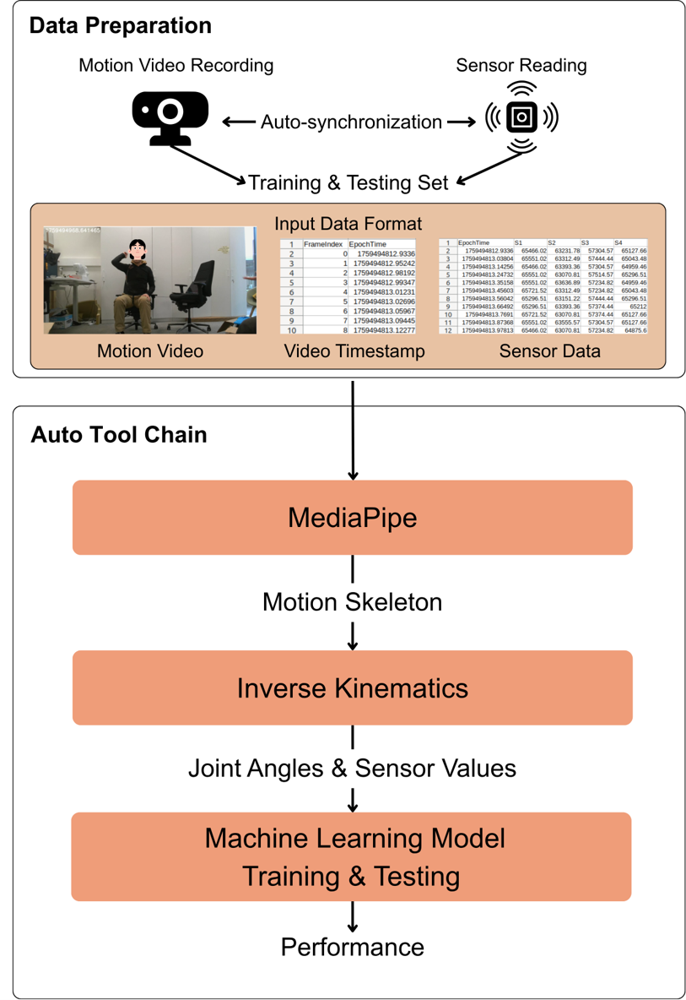
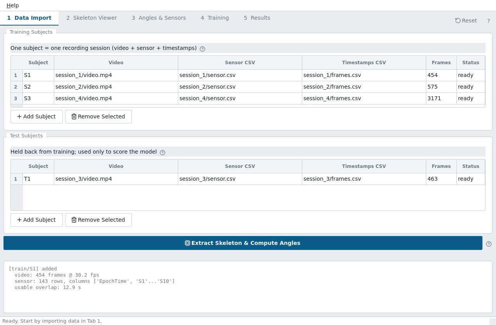
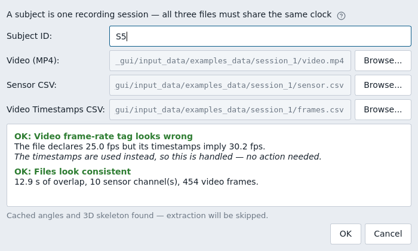
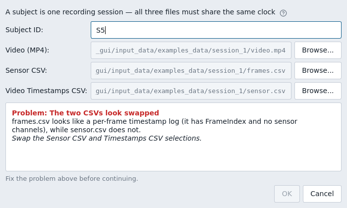
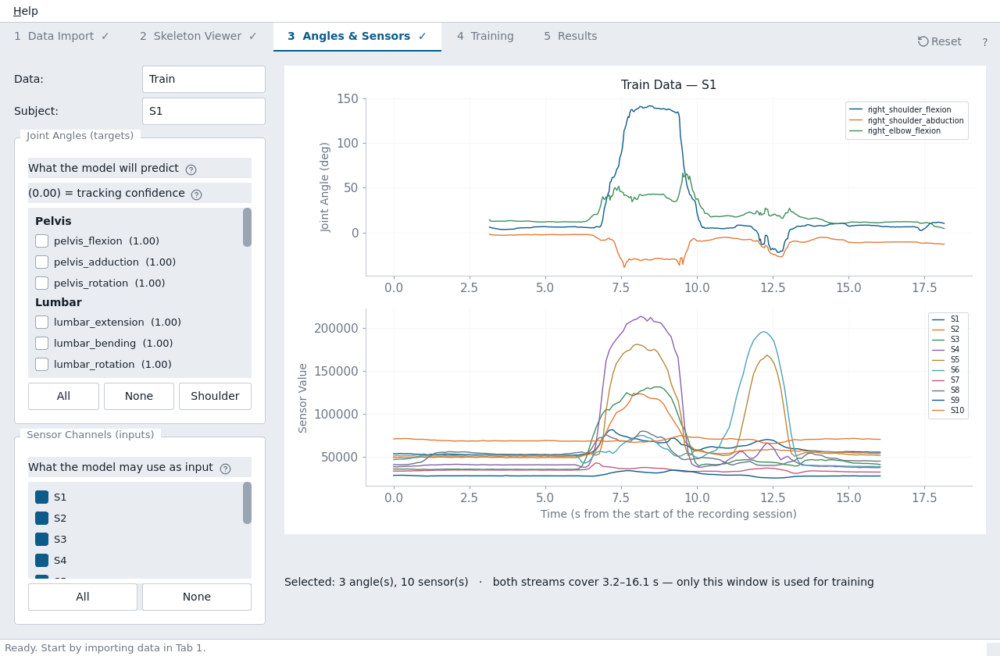
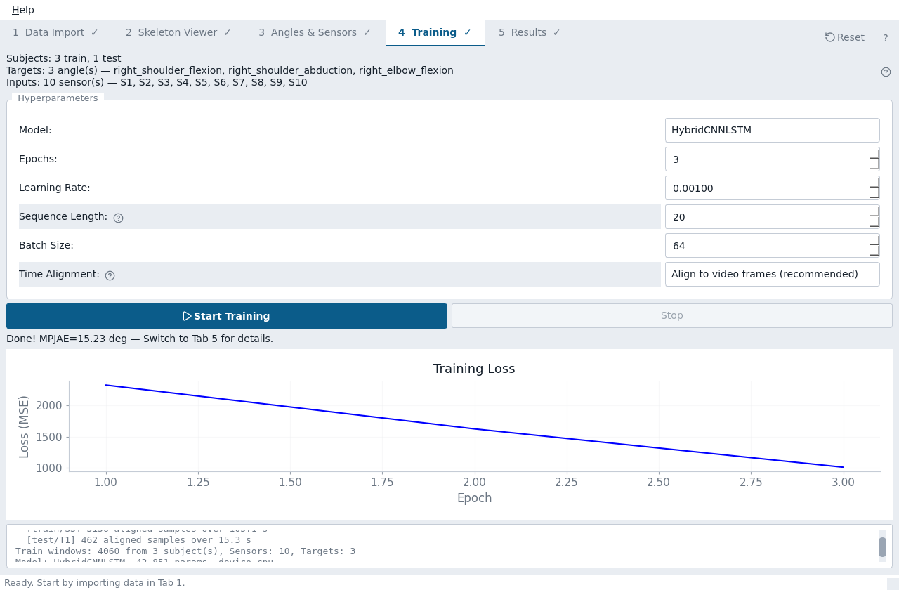
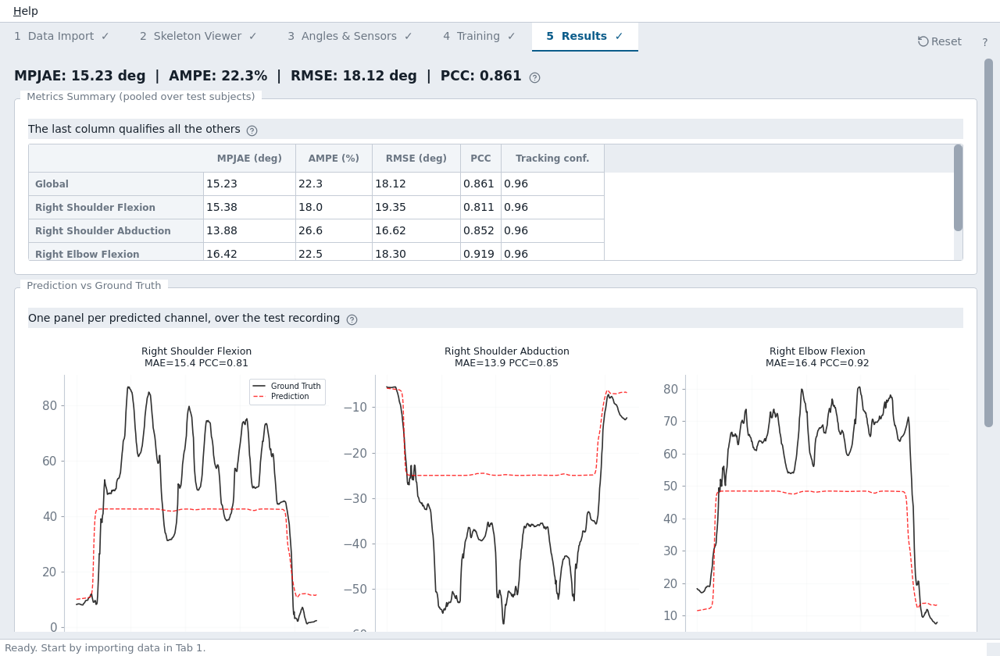

# E-Textile Validation GUI — User Manual

Validate a wearable motion-sensing garment from a webcam recording and a sensor
CSV. No motion-capture lab, no programming.

The app links here directly: **Help → User Manual** (or `F1`), and
**Help → Help for This Tab** opens the section for whichever tab you are on.

- [What the tool does](#what-the-tool-does)
- [Input requirements](#input-requirements) · [recording guide](#recording-guide)
- [Quick walkthrough](#quick-walkthrough)
- [Tab 1 — Data Import](#tab-1--data-import) · [train/test split](#choosing-the-traintest-split)
- [Tab 2 — Skeleton Viewer](#tab-2--skeleton-viewer)
- [Tab 3 — Angles & Sensors](#tab-3--angles--sensors) · [joint angle definitions](#joint-angle-definitions)
- [Tab 4 — Training](#tab-4--training) · [changing targets/inputs](#changing-targets-and-inputs) · [hyperparameters](#hyperparameters)
- [Tab 5 — Results](#tab-5--results) · [reading the numbers](#reading-the-numbers)
- [Glossary](#glossary)
- [Troubleshooting](#troubleshooting)

---

## What the tool does

You record someone wearing the garment with an ordinary webcam, while the
garment's sensors log to a CSV. The tool then:

1. finds the body in every video frame and computes **joint angles** from it —
   these are the ground truth, in place of a motion-capture system;
2. puts the sensor stream and the joint angles on the **same timeline**;
3. trains a model to predict the joint angles you choose **from the sensor
   channels you choose**;
4. reports **how accurate that prediction is, per joint**.

That last number is what tells you whether a garment revision is better than the
last one.



**What it is for:** comparing revisions of a garment under the same conditions.
**What it is not for:** absolute clinical joint angles. Single-camera pose
estimation is not accurate enough for that, and the tool shows you its own
confidence so you can see where it is weakest.

---

## Input requirements

Read this section before recording anything — most problems start here.

### Three files per recording session

A **subject** in the app is one recording session, and it needs all three files
together:

| File | What it is | Must contain |
|---|---|---|
| `video.mp4` | the webcam recording | H.264 MP4 preferred; `.avi`, `.mov`, `.mkv`, `.m4v` also accepted |
| `sensor.csv` | the garment's readings | a timestamp column, plus one numeric column per sensing element |
| `frames.csv` | when each video frame was captured | `EpochTime`, and ideally `FrameIndex` |

### The one rule that matters: a shared clock

All three files must refer to **the same absolute clock** — Unix time in seconds.
That is how the tool knows which sensor reading belongs with which video frame.

```
sensor.csv                          frames.csv
EpochTime;S1;S2;S3                  FrameIndex;EpochTime;Marker
1759494812.93;65466;63231;57304     0;1759494812.9336;
1759494813.04;65551;63312;57444     1;1759494812.9524;
```

Time measured *from the start of each recording* cannot be used — the two streams
would have no way to line up. The tool checks for this and refuses the files.

Only the **overlap** of the two streams is usable. If the sensor logger ran for
100 s but the video covers 15 s of that, you get 15 s of training data.

### Recording guide

#### Camera

- One webcam, **1.5–3 m** in front of the person, at roughly chest height.
- **Whole body in frame** for the entire recording, including during the widest
  movement. Check the extremes before recording, not after.
- Keep the camera **still** — on a tripod or a stable surface. The reference
  frame is derived from the body, but a moving camera adds noise to every
  landmark.
- Plain background if possible; avoid other people in shot.

#### Lighting

- Even, diffuse light from the front. Overhead office lighting is usually fine.
- **Avoid backlight** — a window behind the person is the single most common
  cause of poor tracking.
- No strong shadows across the body.

#### Clothing

- The garment's sensing area must be **visible and uncovered**.
- Avoid clothing the same colour as the background.
- Very loose clothing hides the underlying joint positions and lowers tracking
  confidence on the limbs it covers.

#### Movement

- Exercise the joints you intend to measure, through a **usable range** — a
  channel that barely moves cannot be validated.
- Keep the limbs of interest **facing the camera**. Out-of-plane and self-occluded
  motion is where single-camera pose estimation is weakest, which the confidence
  display will show you.
- Repeat each movement several times, at a natural speed.

#### Common mistakes

| Mistake | Consequence |
|---|---|
| Sensor logger and video started from separate clocks | files are rejected — no overlap |
| Sensor logger left running much longer than the video | only the overlap is usable; most data wasted |
| Person partly out of frame | limbs go red in the Skeleton Viewer; those channels unusable |
| Facing sideways | the tracked joints are self-occluded |
| Sitting behind a desk | lower-body channels are meaningless |
| Recording only one repetition | not enough data to train on |

### Recording your own data

Working reference scripts are in `external/data_collection/`. They are not part
of the application — they are the code the bundled example data was recorded
with, and the simplest way to see what "a shared clock" means in practice.

| Script | What it does |
|---|---|
| `video/record_video_train 1.py` | captures from a webcam, writes `train.mp4` **and** the matching `train_video.csv` (`FrameIndex;EpochTime;Marker`), and burns the epoch time into each frame |
| `video/record_video_test 1.py` | the same, for the held-out recording |
| `IMU/protoype_codes/save_serial.py` | reads the garment over a serial port and writes `EpochTime;S1;S2;…` |
| `IMU/protoype_codes/flex_master/`, `flex_slave/` | Arduino sketches for the sensing hardware |
| `IMU/protoype_codes/read_angle.py` | reads angles directly from an IMU, for comparison |

**Why they matter:** both sides call `time.time()`, so the video timestamps and
the sensor rows land on the same absolute clock without any manual
synchronisation. That is the requirement the tool cannot work without, and the
one most often got wrong. Adapt these rather than starting from scratch.

Two details worth copying:

- The video script writes the timestamp CSV **as it captures**, one row per
  frame — not reconstructed afterwards from an assumed frame rate. That is why a
  wrong frame-rate tag in the MP4 does not matter.
- It also draws the epoch onto the frame. Purely a debugging aid, but it lets you
  verify the alignment by eye later, which is how the bundled example was checked.

Both are started by hand, so start the sensor logger first and stop it last; only
the overlap is used.

### Things that are handled for you

- **`;` or `,`** separated CSVs both work.
- **A wrong frame-rate tag in the MP4.** Container metadata is often wrong — the
  bundled examples claim 25 fps but were captured at ~30. The timestamps are
  believed instead, and the app tells you when they disagree.
- **Different sample rates.** The sensor typically runs far slower than the video
  (9 Hz vs 30 fps is normal). The streams are interpolated onto a common
  timeline; you do not need to match them yourself.

### Multiple subjects

Add as many sessions as you like to Training and to Test. Every session must
expose **the same sensor channel names** — only channels present in all of them
can be used, and the app says which are being ignored.

---

## Quick walkthrough

Using the bundled `input_data/examples_data` (four real sessions, one
participant, 10 channels):

1. **Tab 1** → **+ Add Subject** under *Training Subjects*, three times, for
   `session_1`, `session_2`, `session_4`. Then once under *Test Subjects* for
   `session_3`.
2. Click **Extract Skeleton & Compute Angles**. This is the slow step — roughly
   0.1 s per video frame, so about 8 minutes for all four sessions. A progress
   window shows which session is being processed, how far through it is and
   roughly how long is left; it blocks the rest of the window so nothing is
   changed underneath a running job, and **Cancel** stops it. Results are cached,
   so you only pay this once per recording.
3. **Tab 2** → drag the timeline. Check the skeleton follows the body. Click
   **Tracking Quality** to see which joints were tracked worst.
4. **Tab 3** → tick the joint angles you want to predict (try the three
   right-shoulder channels) and leave all sensor channels ticked.
5. **Tab 4** → **Start Training**. Defaults are fine.
6. **Tab 5** → read the per-joint accuracy.

A tick appears on each tab in the bar as you complete that step.

### Starting over

**Reset**, at the right-hand end of the tab bar, is available from every tab. It
asks for confirmation, then clears everything — subjects, the selected joint
angles and sensor channels, the trained model and all results — and returns you
to Tab 1.

Use it between experiments rather than removing subjects one at a time: leaving
an old model or an old selection behind is how results get attributed to the
wrong data.

If an extraction or a training run is still going, Reset offers to stop it. The
joint angles already computed stay cached, so re-adding those recordings does not
re-extract them.

---

## Tab 1 — Data Import



Two lists: sessions used for **training** the model, and sessions held back to
**test** it. Keeping them separate is what makes the reported accuracy
meaningful — a model scored on data it trained on always looks better than it is.

| Control | What it does | When to use it |
|---|---|---|
| **+ Add Subject** (Training) | opens the dialog to add one session to the training set | for each recording you want the model to learn from |
| **+ Add Subject** (Test) | same, for the held-out set | at least one session, kept out of training |
| **Remove Selected** | drops the highlighted row | wrong file picked, or excluding a bad recording |
| **Extract Skeleton & Compute Angles** | runs pose tracking on every session that has not been processed | once after adding sessions |
| Log pane (bottom) | per-session summary: frames, channels, usable overlap, tracking quality | to confirm each session looks as expected |
| **Reset** (tab bar, far right) | clears everything and returns to this tab | between experiments; available from any tab |

The **Status** column shows `pending` → `extracting` → `ready`. Only `ready`
sessions are used later.

### The Add Subject dialog



Pick the three files. **OK stays greyed out** until all three are chosen *and*
they pass validation, so a bad session cannot get in.

If something is wrong, it is explained here rather than failing later:



Problems that block: unreadable or empty files, a video that cannot be decoded,
a sensor CSV with no timestamp column or no data channels, a `frames.csv` with no
`EpochTime`, timestamps that are not wall-clock time, streams that do not overlap
in time, and the two CSVs being selected the wrong way round. Warnings — a very
short recording, little overlap — let you continue but say what to expect.

### Caching

After extraction, joint angles are saved next to each video as
`<video>.angles.npz`. Re-adding that session later is instant. Delete the `.npz`
to force a fresh extraction.

### Choosing the train/test split

**Always keep at least one session out of training.** A model scored on data it
learned from always looks better than it is, and that inflated number is exactly
the one you would carry into a design decision.

Practical guidance:

- **Held-out sessions should be the ones you care about generalising to.** If the
  garment must work on a new wearer, hold out a whole person — not a few seconds
  of the same recording.
- **More training sessions beats longer training sessions.** Three 30-second
  recordings of different movements teach more than one 90-second recording of
  the same movement.
- **Put your longest recordings in training**, since that is where sample count
  helps most, and hold out a mid-length one.
- **Every session needs the same sensor channel names.** Only channels common to
  all of them can be used; the app says which are being ignored.

With the bundled example, a reasonable split is sessions **1, 2 and 4** for
training and **session 3** held out — that keeps the two longest recordings on
the training side.

**One caveat about the bundled data:** all four sessions are the same
participant. That measures whether the garment works repeatably on one body, not
whether it generalises across people. For a real validation, hold out a different
wearer.

---

## Tab 2 — Skeleton Viewer

Check that the pose tracking actually worked, *before* trusting any accuracy
number that depends on it.

Left: the video frame. Right: the 22-joint skeleton the tool reconstructed.

| Control | What it does |
|---|---|
| **Data** | switch between the training and test lists |
| **Subject** | which session to inspect |
| **Play / Pause** | play the reconstruction through |
| Timeline slider | scrub to any frame |
| **Tracking Quality…** | a report on how reliable the tracking was |

**Joints are coloured by confidence** — green is well tracked, red is not. Scrub
through and watch for limbs going red: that is where the ground truth is weakest,
usually because they were occluded.

**Tracking Quality** ranks the least reliable landmarks and every joint-angle
channel, and tells you what fraction of frames fell below the threshold at which
the pose tracker considers a landmark occluded. Channels that depend on the
pelvis or spine are flagged separately: the pose tracker does not observe a
pelvis at all, so those are reconstructed geometrically.

---

## Tab 3 — Angles & Sensors



**This tab defines the machine-learning problem.** What you tick here becomes
what the model predicts, and what it predicts from.

| Control | What it does |
|---|---|
| **Data** / **Subject** | which session the plots show |
| **Joint Angles (targets)** | the 26 angles the model can predict, grouped by body part — scroll the list to reach them all |
| **All** / **None** / **Shoulder** | quick selection, under the angle list |
| **Sensor Channels (inputs)** | which garment channels the model may use — one tickbox per channel, also scrollable |
| **All** / **None** | quick selection, under the sensor list |
| Upper plot | the selected joint angles over time |
| Lower plot | the selected sensor channels, on the same time axis |

Each angle is labelled with its **mean tracking confidence** in brackets, and
channels below the threshold are shown in red. Use this: a target whose ground
truth was poorly tracked will produce a bad-looking result no matter how good
the garment is.

Only channels present in **every** session appear. If a session has extra
channels, a note says which are being ignored.

**Choosing targets.** Pick joint angles the garment could plausibly sense — a
sleeve cannot measure knee flexion. Start with two or three related channels
rather than all 26; a focused model trains faster and is easier to interpret.

**Reading the plots together** is the quickest way to see whether the garment
works at all: if a sensor trace visibly follows the angle trace, the model will
find that relationship.

Both plots are drawn on one clock — the seconds counted from whichever of the
two recordings started first — so a point directly above another is the same
instant, and you can compare the panels by eye. The video and the sensor logger
are rarely started at the same moment, so one trace usually begins later than
the other. The line under the plots gives the window both streams cover; only
that window can be used for training.

### Joint angle definitions

The 26 channels below are computed from the reconstructed skeleton following ISB
conventions — Wu et al., *J. Biomech.* 35(4) 2002 (ankle, hip, spine) and 38(5)
2005 (shoulder, elbow, wrist). **What matters in practice is the sign
convention**, because that is what determines whether your sensor correlates
positively or negatively with the channel you picked.

#### Two kinds of channel

**Signed channels** are measured against a body-fixed reference frame, so they
run through zero and can be negative. Twelve of them are rotational and are
unwrapped frame to frame, so ±180° discontinuities do not appear as jumps.

**Unsigned channels** — the knee, ankle and elbow — are the angle *between two
body segments*, computed as `arccos` of the dot product. They therefore run
0–180° and **cannot be negative**. Zero means the two segments are in line:

- `knee_flexion = 0` → leg straight; `≈ 90` → seated
- `elbow_flexion = 0` → arm straight; `≈ 90` → forearm at right angles
- `ankle_flexion` → angle between shank and foot

This is worth knowing before you look for a correlation: an unsigned channel
cannot distinguish flexion from hyperextension, and a sensor that does will look
worse than it is.

#### The channels

Observed ranges are from `session_1` of the bundled example (one seated
participant, arm movements) — they show what the numbers actually look like, not
the anatomical limits.

| Channel | Joint | Signed? | Zero means | Observed in example |
|---|---|:--:|---|---|
| `pelvis_flexion` | pelvis | yes | pelvis upright | −6 … +6 |
| `pelvis_adduction` | pelvis | yes | pelvis level side-to-side | −10 … +3 |
| `pelvis_rotation` | pelvis | yes | pelvis square to forward | +6 … +18 |
| `lumbar_extension` | trunk | yes | trunk upright | **always 0 — see below** |
| `lumbar_bending` | trunk | yes | trunk not leaning sideways | −8 … +7 |
| `lumbar_rotation` | trunk | yes | shoulders square over pelvis | −25 … −9 |
| `left_hip_flexion` / `right_hip_flexion` | hip | yes | thigh in line with trunk | 73 … 103 (seated) |
| `left_hip_abduction` / `right_hip_abduction` | hip | yes | thigh in the sagittal plane | −4 … +25 |
| `left_hip_rotation` / `right_hip_rotation` | hip | yes | shank straight below thigh | −16 … +12 |
| `left_knee_flexion` / `right_knee_flexion` | knee | **no** | leg straight | 81 … 102 (seated) |
| `left_ankle_flexion` / `right_ankle_flexion` | ankle | **no** | foot in line with shank | 29 … 70 |
| `left_shoulder_flexion` / `right_shoulder_flexion` | shoulder | yes | arm hanging down | −23 … +142 |
| `left_shoulder_abduction` / `right_shoulder_abduction` | shoulder | yes | arm in the sagittal plane | −39 … −2 |
| `left_shoulder_rotation` / `right_shoulder_rotation` | shoulder | yes | forearm in the plane of the upper arm | −35 … +45 |
| `left_elbow_flexion` / `right_elbow_flexion` | elbow | **no** | arm straight | 2 … 67 |
| `neck_flexion` | neck | yes | head upright | 57 … 77 |
| `neck_bending` | neck | yes | head not tilted sideways | −30 … +5 |

The twelve unwrapped rotational channels are the three pelvis channels, both hip
rotations, both shoulder flexions, both shoulder rotations, lumbar rotation, and
both neck channels.

#### `lumbar_extension` does not work — do not use it

The pose tracker provides no pelvis landmark, so the pelvis is reconstructed from
the hip midpoint. That reconstruction leaves the trunk vector and the body
reference frame collinear, and lumbar extension comes out as **exactly 0° in
every frame** — confirmed in the example data above.

It is listed for completeness only. Picking it as a target will train a model
against a constant. `lumbar_bending` and `lumbar_rotation` are unaffected and
usable.

More generally, every channel that depends on the synthesised pelvis or spine is
flagged in the **Tracking Quality** view, because those carry a geometric
assumption on top of whatever the tracking confidence says.

---

## Tab 4 — Training



| Control | What it does | Default | When to change it |
|---|---|---|---|
| **Model** | `HybridCNNLSTM` or `SimpleCNN1D` | HybridCNNLSTM | try SimpleCNN1D for very few channels or very little data |
| **Epochs** | passes over the training data | 50 | raise if the loss is still falling at the end |
| **Learning Rate** | step size | 0.001 | lower if the loss curve is erratic |
| **Sequence Length** | frames of history per prediction | 40 | lower for short recordings — a session shorter than this contributes nothing |
| **Batch Size** | samples per step | 32 | rarely needs changing |
| **Time Alignment** | which clock to resample onto | Align to video frames | leave it; the alternative aligns to sensor samples and yields fewer points |
| **Start Training** | trains, then evaluates on the test sessions; a progress window shows the epoch, the current loss and an estimate of the time left | | |
| **Stop** | interrupts training | | |
| Loss curve | training error per epoch | | should fall and flatten |
| Log pane | per-session sample counts, model size, per-subject results | | check each session contributed samples |

Each training session is aligned and windowed **separately** before being pooled,
so no training example ever spans two recordings.

Watch the log for sessions that were skipped — a recording with no time overlap,
or shorter than the sequence length, is reported and excluded rather than
silently dropped.

### Changing targets and inputs

Tab 4 *shows* what will be trained but does not let you change it. The three
parts come from different places:

| What | Where to change it |
|---|---|
| Which sessions are used | **Tab 1** — add or remove subjects in the Training / Test lists |
| Which joint angles are predicted | **Tab 3** — the *Joint Angles (targets)* checkboxes |
| Which sensor channels are used | **Tab 3** — the *Sensor Channels (inputs)* checkboxes |

Changing any of them and pressing **Start Training** again trains a fresh model;
previous results are discarded, so nothing stale is left on the dashboard.

If Tab 4 reports **0 subjects**, no session has finished extraction — go back to
Tab 1 and run *Extract Skeleton & Compute Angles*.

**A useful loop.** Train once with all sensor channels, read *Sensor Importance*
on Tab 5, then retrain with only the channels that mattered. If accuracy holds,
the others are redundant and the next garment revision can drop them.

### Hyperparameters

The defaults are reasonable for a first run. This table is symptom-first.

| Symptom | Change | Why |
|---|---|---|
| The log says sessions were **skipped** | lower **Sequence Length** | A session with fewer aligned samples than the sequence length contributes nothing. This is the most common cause of "no data". |
| Loss is still falling at the last epoch | raise **Epochs** | The model had not finished learning. |
| Loss jumps around instead of settling | lower **Learning Rate** (try 0.0003) | Steps are too large. |
| Loss barely moves at all | raise **Learning Rate** (try 0.003) | Steps are too small. |
| Very little training data | switch **Model** to `SimpleCNN1D` | Fewer parameters, less prone to memorising a small set. |
| Predictions look smoothed, missing fast motion | lower **Sequence Length** | Too much history dilutes short events. |
| Training is too slow to iterate | lower **Epochs**, raise **Batch Size** | Fewer, larger steps. |

What each one is:

- **Model** — `HybridCNNLSTM` (default) reads the sensor channels with a 1-D
  convolution and the time dimension with an LSTM. `SimpleCNN1D` drops the LSTM:
  smaller and faster, weaker on movements whose history matters.
- **Epochs** — passes over the training data. Default 50.
- **Learning Rate** — step size. Default 0.001.
- **Sequence Length** — frames of sensor history per prediction. Default 40,
  about 1.3 s at 30 fps.
- **Batch Size** — samples per optimisation step. Default 32; rarely matters.
- **Time Alignment** — which clock to resample onto. Leave at *Align to video
  frames*: the ground truth is defined per video frame, and it yields the most
  samples. *Align to sensor samples* gives roughly a third as many.

---

## Tab 5 — Results



| Element | What it shows |
|---|---|
| Headline | overall MPJAE, AMPE, RMSE, PCC |
| **Per-Subject Results** | the same metrics for each test session separately (shown when there are several) |
| **Metrics Summary** | per-joint metrics, plus the ground truth's tracking confidence |
| **Prediction vs Ground Truth** | one panel per predicted channel: the true angle trace in black, the model's in red |
| **Sensor Importance** | which channels the model relied on |
| **Export Metrics CSV** | the metrics table as CSV |
| **Export Report** | a text summary |
| **Save All Plots** | the figures as PNGs |

Check the **per-subject** table before the pooled numbers: one unusual wearer can
carry the average.

**Prediction vs Ground Truth** is the figure to judge the garment by. The tables
give one number per channel; the curves show *where* the error is — a constant
offset, drift over the recording, or a particular movement the sensors miss
entirely. The tab scrolls, so keep going down for the sensor chart and the
export buttons.

**Sensor Importance** is what feeds back into garment design — a channel with
near-zero importance is not contributing and could be moved or removed.

### Reading the numbers

| Metric | Meaning | Better |
|---|---|---|
| **MPJAE** | mean absolute error, in degrees | lower |
| **AMPE** | the same error as a percentage of the angle's range | lower |
| **RMSE** | error in degrees, penalising large mistakes more | lower |
| **PCC** | correlation between prediction and truth, −1 to 1 | closer to 1 |
| **Tracking conf.** | how well the *ground truth* for that channel was tracked, 0 to 1 | closer to 1 |

The last column changes how to read the others. A large error on a channel with
low tracking confidence tells you little about the garment — the reference itself
was unreliable. A large error on a well-tracked channel is a real finding.

PCC and MPJAE answer different questions. High PCC with high MPJAE means the
sensor follows the *shape* of the movement but is offset or scaled — often
fixable by calibration. Low PCC means the relationship is not being captured at
all.

**Absolute values are not clinical measurements.** Use these numbers to compare
garment revisions recorded the same way, which is what they are reliable for.

#### Diagnosing from PCC and MPJAE together

The two answer different questions, and the combination is more informative than
either alone.

| PCC | MPJAE | What it means | What to do |
|---|---|---|---|
| high | low | The garment tracks this angle well. | Nothing — this is the result you want. |
| **high** | **high** | The sensor follows the *shape* of the movement but is offset or scaled. | Usually calibration, not sensor placement. Often the most encouraging failure. |
| low | low | The angle barely moved, so the error is small by default. | Not evidence of anything. Record a movement that actually exercises this joint. |
| low | high | No usable relationship was found. | Check tracking confidence first; if that is fine, the sensor is not picking up this motion. |

A negative PCC on a channel that should work often means an inverted sign — see
[joint angle definitions](#joint-angle-definitions), especially the unsigned
channels.

#### Before trusting any of it

Check, in this order:

1. **Tracking confidence** for the target channel. Low confidence invalidates
   the row.
2. **Per-subject spread.** If one test session is far worse, report that rather
   than the average.
3. **Whether the movement happened.** A flat ground-truth trace in
   *Prediction vs Ground Truth* means the recording did not exercise that joint.

---

## Troubleshooting

**"The two CSVs look swapped"**
The sensor and timestamp files were selected the wrong way round. Both are valid
CSVs, so nothing else would notice. Swap them.

**"Sensor and video do not overlap in time"**
The two files are from different recordings, or one logger's clock was wrong. The
message shows both time ranges and the gap between them.

**"Sensor CSV timestamps are not wall-clock time"**
The CSV logs time from the start of the recording instead of Unix time. Both
files must use the same absolute clock; re-export with absolute timestamps.

**"Video cannot be read"**
The file is corrupt or in an unsupported codec. Re-export as H.264 MP4.

**"Video frame-rate tag looks wrong"**
Informational, no action needed. The container's declared frame rate disagrees
with the timestamps; the timestamps are used.

**Tab 2 says "3D skeleton not in this cache"**
The session was restored from a cache written before 3D joints were stored.
Angles, training and results all work; only the viewer needs the geometry.
Delete the `.angles.npz` next to the video and extract again to restore it.

**Training says a session was skipped**
Either it had no usable time overlap, or it was shorter than the sequence length.
Lower **Sequence Length** in Tab 4, or exclude the session.

**Tracking confidence is low everywhere**
Usually the recording: the person too far away or partly out of frame, poor or
uneven lighting, or the body occluded by furniture. Re-record with the whole body
visible and even lighting.

**Extraction is very slow**
Expected — roughly 0.1 s per frame on a laptop CPU. A two-minute recording takes
several minutes. It runs once per recording and is then cached.

**Windows warns about an unrecognised app**
The executable is not code-signed. Choose *More info → Run anyway*.

## Glossary

| Term | Meaning |
|---|---|
| **Subject** | One recording session in the app: a video, a sensor CSV and a timestamp CSV that belong together. Not necessarily a different person. |
| **Session** | The recording itself. Used interchangeably with subject here. |
| **Sensor channel** | One sensing element on the garment — one numeric column in `sensor.csv`, e.g. `S3`. |
| **Joint-angle channel** | One anatomical degree of freedom, e.g. `right_knee_flexion`. 26 are computed. |
| **Target** | A joint-angle channel the model is asked to predict. Chosen in Tab 3. |
| **Input** | A sensor channel the model may use. Chosen in Tab 3. |
| **Ground truth** | The joint angles derived from the video, used as the reference the sensors are scored against. Not a gold standard — see tracking confidence. |
| **Overlap** | The wall-clock window in which both the sensor and the video have data. Everything outside it is discarded. |
| **Alignment** | Resampling the two streams onto one clock so each sensor reading has a matching joint angle. |
| **Window / sequence** | The run of consecutive frames the model sees for one prediction. Its length is *Sequence Length*. |
| **Epoch** | One pass over the training data. Unrelated to *EpochTime*, which is a Unix timestamp. |
| **Tracking confidence** | The pose tracker's own 0–1 estimate of how reliable a landmark was, propagated to joints and angle channels. |
| **Pooled** | Metrics computed over all test sessions together, as opposed to per-subject. |
| **MPJAE** | Mean Per-Joint Absolute Error, in degrees. |
| **Cache** | `<video>.angles.npz` next to each video, holding computed angles so extraction is not repeated. |

---

---

## Command line

Not needed for normal use.

```bash
python app.py --selftest      # check the installation
python benchmarks/run_benchmark.py --data-dir input_data/examples_data \
    --train-sessions 1,2,4 --test-sessions 3
```
